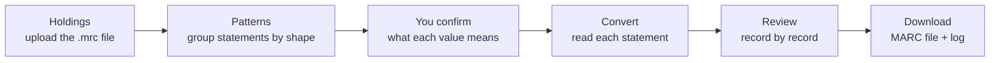
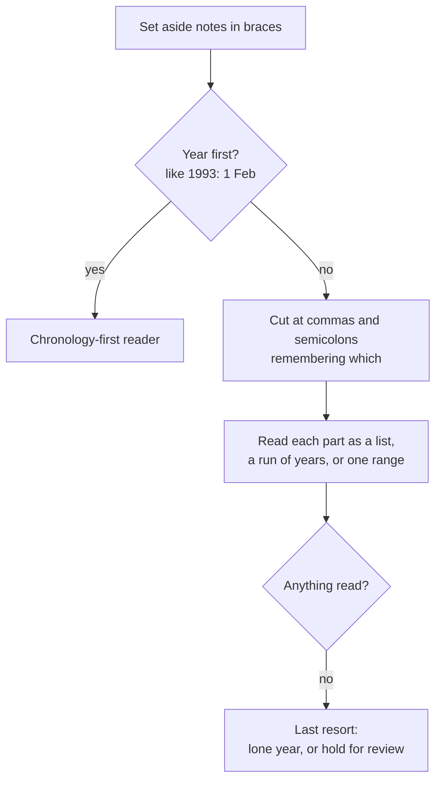

# How the Holdings Workbench Works

*Written for librarians and cataloguers. Describes version 0.30.0.*

The Holdings Workbench turns the free-text holdings in MARC 866 fields into structured 853 caption/pattern and 863 enumeration/chronology fields, and asks a cataloguer to confirm anything it cannot be sure of. This guide explains how, for librarians rather than programmers.

## The big picture

You give the Workbench a MARC file. It reads every record's 866 statements, works out which number is a volume, which is an issue and which is a year, and writes an 853 and its 863s. You get the file back with a log of everything it could not do cleanly.

One 866 in, one 853 and one 863 out:

| Field | What it holds |
| --- | --- |
| 866 (what you have) | `v.1:no.1(1990:Jan.)-v.5:no.4(1994:Dec.)` |
| 853 (the captions) | `853 31 $8 1 $a v. $b no. $v r $i (year) $j (month)` |
| 863 (the values) | `863 40 $8 1.1 $a 1-5 $b 1-4 $i 1990-1994 $j 01-12` |

The 853 says what each subfield of the 863 is called. The 863 holds the values, and the two are tied together by `$8`: the 863's `1.1` means "the first holding under the 853 numbered 1".

The work happens in three steps, which are the three parts of the screen:



The Patterns step is optional. With no confirmed patterns, every statement is read by the standard parser alone, and the result is the same as if the Patterns step did not exist.

A few things hold throughout:

- **It runs on your own machine.** No network calls, no API key, no AI model. Nothing leaves the computer.
- **It is deterministic.** The same file and the same choices always give the same output.
- **Your choices last one session.** Skips, edits and notes are kept until you upload a new file. The log is how you keep them.
- **Nothing disappears silently.** Every value in an 866 is either encoded, or named in a warning, or the record is held for you to look at.

## Two parts that read statements: the detector and the parser

The **standard parser** reads every statement, whether or not a pattern matches it. The **pattern detector** reads nothing into MARC itself. Its job is to sort statements into groups of the same shape, so you can say once, for a whole group, what each value means.

|  | Pattern detector | Standard parser |
| --- | --- | --- |
| Looks at | All the statements in the file at once | One statement at a time |
| Produces | Groups of statements with the same shape, each with a matching rule | The volumes, issues, years and months of one statement |
| Knows the meaning of a value? | No: it sees that a number follows "v." but not that you agree it is a volume | Yes, where the statement says so |
| Asks you | What each value in the group means, once per group | Nothing. It holds a statement for review when it can't tell |

A confirmed pattern supplies only what the parser cannot work out for itself:

- **The meaning of a bare number.** In `?: 16`, nothing says whether 16 is a volume or an issue. The parser refuses to guess and holds the record. If you have confirmed that shape's number as a volume, it converts.
- **A caption for a level written without one.** The parser writes `(*)` in the 853 for an unnamed level. Your confirmed caption, such as `v.`, fills it. A caption the statement actually prints is never overwritten.
- **"Leave these alone."** A pattern marked Skip claims every statement of that shape, and none of them is converted.

Where a statement holds several runs of holdings, such as `v. 19 nos. 1, 3, 5, 7-12`, the parser reads it even if a pattern matches, and the record says so. A pattern describes one run, and applying it would have kept only the first and last values.

Until version 0.10.0 a matched pattern read the statement a second way, on its own. Across 141 test statements the two readings disagreed on 10, and the pattern was wrong on 9 of those. Since then the parser has done all the reading, and a test checks that both routes write the same 863.

## Tokenization: how the detector reads a statement

The detector cuts each statement into small labelled pieces, called **tokens**, much as you might mark up a sentence with parts of speech. Two statements whose pieces carry the same labels in the same order have the same shape, and go into the same group. The actual numbers don't matter to the grouping, only what kind of thing each piece is.

### The pieces it recognizes

| Label | What it catches | Examples |
| --- | --- | --- |
| Volume caption | v, v., vol., volume | `v.` `Vol.` `volume` |
| Issue caption | no., nr., num., number, iss., issue | `no.` `No.` `iss.` |
| Part caption | pt., part | `pt.` `Part` |
| Year | A four-digit year from 1800 to 2099, including one split across the new year | `1990` `1996/97` |
| Month or season | Any month (full or abbreviated) or season, including combined ones | `Jan` `Sept` `Winter` `Jul/Aug` |
| Number | Any other number, with an optional letter, including combined issues | `5` `4a` `8/9` |
| Punctuation | ( ) : - , each gets its own label |  |
| Space | Any run of spaces |  |
| Free text | Anything else, one character at a time | `Library has`, `Suppl.` |

Capitals never matter: `V.`, `v.` and `VOL.` are all volume captions. Neither do spaces: they are recognized and then set aside, so `v.1` and `v. 1` have the same shape.

### Reading left to right, first rule wins

The detector starts at the first character and asks each rule in turn, in the order of the table above, whether the text starting here fits. The first rule that fits takes that text. Then it moves on to the next unread character. The order is what makes it read the way a cataloguer would:

- **Years before numbers.** `1990` is a year, not just a number, because the year rule is asked first.
- **Months before issue captions.** `Nov.` is November. If the issue rule were asked first, it would take `No` as "number" and leave `v.` to be read as a volume caption.
- **A whole word only.** `v` counts as a volume caption only where a word starts, so the v inside a word isn't taken for one. Likewise `springtime` isn't a season.

Here is `Vol. 1, No. 1 (Spring 1990)-Vol. 5, No. 4 (Winter 1994)` read into pieces, with the spaces set aside:

```
Vol.  1   ,  No.  1   (  Spring  1990  )  -  Vol.  5   ,  No.  4   (  Winter  1994  )
VOL   NUM ,  ISS  NUM (  CHRON   YEAR  )  -  VOL   NUM ,  ISS  NUM (  CHRON   YEAR  )
```

### What is kept together as one piece

Some things look like two values but are one, and are read as one piece:

- **A split year:** `1996/97` is one year, the one a winter issue straddles.
- **A combined month or season:** `Jul/Aug` and `Winter/Spring` are one chronology value.
- **A combined issue:** `no. 8/9` is one issue numbered 8/9, not issues 8 and 9.
- **A month with its full stop:** `Jan.` is one month, so `(Jan. 1990)` and `(Jan 1990)` have the same shape. Before version 0.25.2 the full stop was read as a separate scrap of free text, and the two landed in different groups.

This matters. When `8/9` was read as two numbers, `v. 34 no. 8/9-v. 35 no. 23/24` came out with the 9 treated as a volume and the 35 as an issue, and converted to `$a 34 $b 8`.

### The hyphen: "through", or "one value"?

A hyphen between two numbers means one of two quite different things, and the detector has to look at the whole statement to tell which:

| Statement | What `3-4` or `1-5` means | How it is read |
| --- | --- | --- |
| `v.1-5(1990-1994)` | Volume 1 **through** volume 5: two ends of a range | Two numbers with a hyphen between, so you can confirm each end |
| `v. 23 no. 3-4-v. 29 no. 3-4` | Issues 3-4 **of** v. 23: one value inside a larger range | One number, `3-4` |

The test is whether some **other** hyphen divides the statement into a start and an end. That is a hyphen just after a closing parenthesis, as in `(1990)-v.5`, or just before a caption, as in `-v. 29`. If there is one, the statement has two halves, and a number-hyphen-number inside a half is merged into one value. If there isn't, the hyphen means "through" and the two numbers stay separate.

### Free text and notes

Anything the rules don't recognize, such as `Library has:`, `Suppl.` or `[lacks v.3]`, is read one character at a time as free text. Each unbroken stretch of free text is then joined into one piece, shown as ‹text›. So `Library has: v.1(1990)` and `[lacks] v.1(1990)` have the same shape, even though their notes differ in length.

### From pieces to a shape

The labels in order are the statement's **signature**. Every statement with the same signature goes into the same group. The screen shows each group under a short heading built from the same pieces:

| In the heading | Means |
| --- | --- |
| `VOL`, `ISS`, `PT` | A caption with its number (`v.1`, `no. 4`) |
| `#` | A number with no caption in front of it |
| `YEAR`, `CHRON` | A year; a month or season |
| ‹text› | Free text |
| `—` (long dash) | The dash dividing the start of the holdings from the end |
| `–` at the end | An open range: currently received |

So `v.1(1990)-v.5(1994)` and `V. 3 (1980)-v. 9 (1986)` share the heading `VOL(YEAR) — VOL(YEAR)` and are one group. Where the statement had a space between two pieces, the heading keeps one: `v. 9 no. 1 (Nov 1902)` is headed `VOL ISS(CHRON YEAR)`. Dates written after the numbering without parentheses are joined by an ordinary hyphen, as they would be inside them: `v.3-36 1963-1995` is `VOL-VOL YEAR-YEAR`.

### From a shape to a matching rule

For each group the detector writes a matching rule, called a **regular expression**. It is the formal description of the shape, and it is used to decide later which statements the pattern applies to. It is built piece by piece:

- **Captions** accept every form seen in the group. If the group holds both `v.` and `V.`, either will match.
- **Numbers, years and months** become named slots, such as `start_vol`, `end_year` or `start_month`. These names are the detector's guess at what each value is, and they are what the confirm screen asks you about.
- **Months** accept any month or season, not only the ones seen, so a pattern found from `Apr` still matches a later `Winter` in the same place.
- **Free text** accepts any text up to a similar length, rounded up to a multiple of 8 characters, so a slightly different note still matches.

The rule is then tried against every statement in its own group, and the screen shows how many it matches in full. A partial match doesn't count.

**Start or end.** The first value of a kind (the first volume, the first year) is named start, and the second is named end. A third value of the same kind has nowhere to go, so it is offered as "not encoded".

**Limits.** A group whose statements run past 40 pieces, or whose rule would be longer than 4,000 characters, isn't offered as a pattern. It is listed as a finding instead, with the reason. These are nearly always one-off statements, and the parser still reads them.

### Before tokenizing: one statement or several?

An 866 can hold more than one range, as in `v.1(1990)-v.3(1992), v.5(1994)-`. Before tokenizing, the statement is cut at each comma, semicolon or spaced slash (`/`) that falls outside parentheses, and each part is grouped on its own. A bare slash is never a cut, since `v.1/2` and `1990/91` mean something. A list of runs such as `v. 19 nos. 1, 3, 5, 7-12 (Jan, Mar, May, Jul-Dec 1915)` is kept whole, because its parts mean nothing alone.

## From groups to confirmed patterns

"Find patterns" shows each group as a card: its heading, how many statements it holds, examples, and one row per value the matching rule picks out. Each card says what confirming it would change, because that varies:

| The card says | What it means | What confirming does |
| --- | --- | --- |
| The parser reads these in full | Every value already has a meaning | Nothing changes. Optional. |
| What you add here is the caption | A level is a bare number, like `39 no 1 (2018)` | The 853 gets your word (`v.`) instead of `(*)` |
| The parser writes nothing for these | Nothing in the wording says what a value is, like `?: 16` or `v.1(1990)-5(1994)` | Your answer is what converts them |

### What you decide for each value

- **What it is:** Enumeration, Year, Month / season, Day, or Not encoded. A value with no caption in front of it starts as "Not yet decided", and the pattern cannot be saved until you choose.
- **Its caption:** offered from `v.`, `no.`, `pt.`, `ser.`, or typed as the piece itself prints it. A title numbered by issue alone can properly have `$a no.`
- **Its level:** the first enumeration value is level 1 (`$a`), the next level 2 (`$b`), and so on, in the order they appear. You can change it.
- **Start or end:** whether it opens or closes the range.

The detector's guesses are shown ready-filled. A caption-less number just before an issue, as in `39 no 1`, is suggested as a volume, but you are still asked. A statement's own caption is always offered as written: one that says `no.` isn't told it is really a volume.

### Confirmed without asking, and never without asking

A pattern where every value already has a meaning is confirmed for you when you press "Find patterns". A pattern that would decide the reading of statements the parser refused is never confirmed automatically. `v. 19 no. 2 Suppl. (1998)` is why: the pattern reads it confidently as volume 19, issue 2, and the supplement, which is the thing the library actually holds, would vanish into an ordinary 863.

A pattern you remove stays removed. Running "Find patterns" again doesn't put it back.

### The pattern library

Confirmed patterns form a library for the session:

- **Order:** patterns are tried largest group first, and the first that matches a whole statement is used. A pattern that matches only part of a statement doesn't apply to it.
- **Skip:** a pattern can be marked "skip" to claim a shape you will handle by hand. Its statements are left exactly as they are.
- **Export and Import:** the library can be saved as a file and loaded again next week, or on another collection. Every pattern is checked as it is loaded, and anything rejected is listed with the reason.
- **Test expression:** each card's rule can be tried against statements before you trust it. Hand-edited rules are allowed.
- **Copy:** each card shows its expression under the heading, with a Copy button. "Copy all expressions" copies every pattern at once, one per line: heading, number of statements, expression. It pastes into a spreadsheet as three columns.
- **Show its records:** each card can filter the record list to "the records with this shape", and, once confirmed, to "the records it converts". The two can differ: a larger pattern may claim some statements first, and an expression may also match a similar shape. A confirmed pattern that converts nothing is a sign a larger one covers all its statements.

## The standard parser: reading one statement

The parser reads a single 866 statement and returns its runs of holdings, each with a start and an end. Each run has enumeration levels (a caption and a value) and chronology (year, month or season, day). It works through the statement in a fixed order, and at each step it prefers to stop and say so rather than guess.



### The steps

1. **Notes come out first.** Text in braces, like `{bound with v.2}`, is removed and reported as a note that wasn't encoded. The holdings around it are still read.
2. **Two grammars.** Most statements put the enumeration first, as in `v.1(1990)`. Some older local records put the year first, as in `2019: (1-6 [Feb-Nov])2020: (7-12 [Jan-Dec])`. These are read by a separate reader, but only when the colon after the year is followed by a volume number or a parenthesis. A word after the colon is Z39.71's own way of writing a date, as in `1990:Jan.-1994:Dec.`, and goes to the main reader. Before version 0.28.0 the year-first reader took those too, and they converted to nothing.
3. **Cutting into parts.** The statement is cut at commas and semicolons outside parentheses. The parser remembers which mark it cut at, because that becomes the 863's break code: a comma means a gap (`$w g`), a semicolon a break that is not a gap (`$w n`). A mark at the very end counts too, as in `1986-1988,`, which is how Alma writes a gap after the last run.
4. **Reading each part.** A part is read as one of three things, tried in this order:
   - A **list of runs**, like `v. 19 nos. 1, 3, 5, 7-12 (Jan, Mar, May, Jul-Dec 1915)`. This becomes four 863s, one for each run, with the months matched to their issues.
   - A **run of years only**, like `(1986-1988, 1993-1994)`. This becomes one 863 for each run.
   - A **single range**, like `v.1:no.1(1990:Jan.)-v.5:no.4(1994:Dec.)`. A hyphen at the end means the holdings are still open (currently received).
5. **The last resort.** If nothing could be read, a lone year like `2016?` is kept, with a warning that the question mark isn't encoded. A lone number like `?: 16` is held for review, because nothing says whether it's a volume, an issue or a year.

### Reading a range

- **Start and end** are divided at the hyphen between two units: one just after a closing parenthesis, or just before a caption. Inside parentheses, `1990-1994` is a range of years. In `v.1-5`, the hyphen means volumes 1 through 5 at one level.
- **Enumeration** is a caption word followed by a value. The parser knows `v.`, `vol.`, `volume` → `v.`; `no.`, `nos.`, `nr.`, `num.`, `iss.`, `issue` → `no.`; `pt.`, `part` → `pt.`; `ser.`, `series` → `ser.`. A value can carry a letter (`4a`) or be combined (`7/8`). The order of levels is the order they appear. The caption word only names a level, it doesn't decide which level it is.
- **Chronology** in parentheses becomes codes. Months become `01`-`12` and seasons `21`-`24`: Spring 21, Summer 22, Fall 23, Winter 24. `Jan/Feb` becomes `01/02`, and `1996/97` becomes `1996/1997`.
- **Dates after the numbering without parentheses**, as older summary statements write them, are read as if they were in parentheses: `v.3-36 1963-1995` gives the same 863 as `v.3-36 (1963-1995)`. The dates have to come last and hold only years, months and seasons, so `v.1 2000 copies` is still held. So is `v.1-3 1990-`, which doesn't say whether the run of volumes is open or the holding is.
- **Dates on their own**, with no volume and no parentheses, are read the Z39.71 way: `1990:Jan.-1994:Dec.` becomes `$i 1990-1994 $j 01-12`, and `2014:Nov. 7` becomes `$i 2014 $j 11 $k 7`.
- **A range inside one end** is read as "through". In `v. 6 nos. 1-3-v. 14 nos. 10-12`, the run starts at no. 1 and ends at no. 12, so the 863 records `$b 1-12`. A compressed 863 holds only the first and last part, one hyphen per subfield. The record is marked to check, because if `1-3` was one combined issue it should have been written `1/3`. Changing the hyphen to a slash in the 866 (with Edit) keeps it whole.
- **A year written before a volume** is the volume's date. `1990: v.1` becomes `$a 1 $i 1990`, and `1990: v.1-1992: v.3` becomes `$a 1-3 $i 1990-1992`. A year before an issue number, as in `2004 no. 3`, is left as a level of numbering, because some journals number by year; the cataloguer confirms that on the pattern. A statement that gives a volume two different years, like `1990: v.1 (1991)`, is held rather than guessed at.

### What it refuses to do

The parser would rather write nothing than write part of a statement. If it reads the first part of a unit and can't account for the rest, it converts nothing from that statement and says exactly where it stopped. For example: "Read 'v. 5 (1990)' but could not account for 'Suppl.'" A caption it doesn't know, like `Bd.`, means "No recognisable holdings ranges found", and the record is held for you to look at.

## Writing the 853 and 863s

Once a statement is read, the converter writes one 853 for its shape and one 863 for each run. Where the standard leaves a choice to the library, the converter uses a stated default, and you can change it in the settings. It never guesses from the statement.

### The 853: captions

- **Enumeration captions** go in `$a`, `$b`, `$c`… in order of level, using the words the statement printed or you confirmed. A level with no caption anywhere gets `(*)`, which is the standard's "asterisk in place of data". It is never a guessed `v.`.
- **Chronology captions** are `$i (year)`, `$j (month)` or `(season)`, and `$k (day)`.
- **Indicators** default to `3` (compressibility unknown) and `1` (captions verified; all levels may not be present). When you declare how many issues make a volume (`$u`), the first indicator becomes `2`, meaning the holdings can be compressed or expanded. Only the values 0-3 are accepted. Anything else is refused and explained, not written.
- **`$u` and `$w`** (units per higher level, frequency) are written only when you declare them. They are facts about how the serial is published. For example, `v.1-5 (1990-1994)` is just as true of a monthly as of a quarterly.
- **`$v`** (numbering continuity) is written as `r`, numbering restarts each volume, unless you choose "Continuous" or "not specified" in the settings.

### The 863: values

| Subfield | Holds | Example |
| --- | --- | --- |
| `$8` | Link to its 853, then its place in order | `1.1`, `1.2` |
| `$a`-`$f` | Enumeration values, level by level | `$a 1-5 $b 1-4` |
| `$i` / `$j` / `$k` | Year / month or season code / day | `$i 1990-1994 $j 01-12` |
| `$w` | A break before the next 863: `g` gap, `n` not a gap | `$w g` |
| `$x` / `$z` | Staff note / public note, carried from the 866 | `$z Incomplete` |

- **First indicator:** `4` (detailed), or `3` (summary) if you choose it. Libraries mark the same field both ways: in the Library of Congress examples, the same 863 appears as `30` in one document and `40` in another. So this is your declaration, not something the tool infers.
- **Second indicator:** `0` for a range (compressed), `1` for a single issue or volume (uncompressed).
- **Open holdings:** `v.6(1995)-` writes `$a 6- $i 1995-`.
- **Never an empty 863:** if every value of a run is refused, as with a list of months like `(Feb, Jun, Aug 1998)`, no 863 is written for it, and the statement is held with its 866 kept. Before 0.28.0 an 863 holding only `$8` was written, and "Remove each 866" could then delete the holdings.

### Breaks and notes

A comma between two runs, or at the end of a statement, is a gap: `$w g`. A semicolon is a break that is not a gap: `$w n`. Runs that carry straight on, like `v.1-5, v.6-9`, get no break, because nothing is missing between them.

The 866's own notes travel with the holdings: `$z` (public) and `$x` (staff) go to the 863. On a statement with several runs they go on the last 863, and the record says so.

### Linking numbers

Each new 853 takes the lowest `$8` number no 853 on the record already uses, and its 863s are numbered under it. Holdings that fit an 853 already on the record are written under it. Holdings that don't get a second 853 beside it, with a note on the record to check which is right. An existing 853 is never renumbered or replaced.

### Removing the 866

If you choose "Remove each 866", an 866 is removed only when everything in it went somewhere: `$a` into 863s, and `$x`, `$z` and `$8` accounted for. An 866 carrying anything else, such as `$6` (a link to an 880), is kept, and the record says why.

### Two conventions

The **standard** convention follows MARC 21: enumeration in `$a`-`$f`, chronology in `$i`-`$k`, months as codes. The **house** convention reproduces one local practice: the year in `$a`, enumeration pushed down to `$b` and `$c`, and months as text (`Mar`). Either can be adjusted subfield by subfield. A choice that would clash, such as two levels in one subfield, is refused and explained.

## Nothing disappears silently

The rule the whole tool is built around: every value in an 866 is either written into an 863, named in a warning on the record, or the statement is held for you. A value that is dropped with nothing on screen to say so counts as a bug, whatever the reason.

### What each statement can come to

| Outcome | What it means | Shown as |
| --- | --- | --- |
| Converted | Every value went into an 863 | `1 converted` |
| Converted, with something to check | It converted, but a value couldn't be placed or a note needs reading | `1 to check` |
| Held | Nothing was written, because writing part of it would be wrong | `1 held` |
| Skipped | You chose to leave it; nothing was written | `skipped` |

"To check" and "held" are different. A statement to check has been converted, and the warning tells you what to look at. A held statement hasn't been converted at all, and its 866 is left in place.

### Records the tool leaves alone

- **A record with its own 863s** is kept exactly as it is (`has 863s · kept`), unless you tick "Clear existing 853 / 863 first". In the 372-record test export, 13 records had hand-entered 853s and 863s. Before this rule, 38 of their 863s were overwritten.
- **An existing 853 that looks wrong**, such as one with an invalid indicator or two 853s sharing one `$8`, is described on the record (`853 to check`) and never corrected.
- **A record the tool can't read** because something in it is malformed is left exactly as uploaded and marked `could not check`. The rest of the file converts normally.

### Notes above the list

Some things are true of many records at once, so they are shown as a note above the list rather than on every row:

- The encoding level in the Leader, compared with the level you are recording at.
- Holdings more detailed than the level you are recording at.
- Records whose Leader/06 codes a single-part item although their holdings describe a serial.

Each can be folded to one line with Hide. That setting is remembered in your browser for every file you upload.

### The "Needs attention" filter

This filter gathers every record with something held or to check that you haven't marked Skip. Skipping a record means you are handling it yourself, so it leaves the list. Its warnings are still shown when you open it, and it still appears in the log.

## Your decisions, and the session log

Everything you decide is kept for the session and applied every time the file is converted or previewed, so the preview, the conversion and the download always agree. Uploading a new file starts over. Download the log first if you want to keep a record.

### On each record

| Choice | What it does |
| --- | --- |
| **Skip** | Leaves the record exactly as uploaded: nothing converted, no 866 removed, existing 853 and 863s untouched |
| **Keep patterns separate** | Gives each shape of holdings on the record its own 853, even where one records less detail than another. Normally statements that are one publication written with more or less detail share an 853 |
| **Reviewed** | Marks the record as looked at, for the "Not yet reviewed" filter. It changes nothing in the output |
| **Edit an 866** | Corrects a typo before conversion, such as `(Fal 1995-Fall 1999)`. The corrected text goes into the file, and "Put back as uploaded" undoes it |
| **Your note** | A reminder for you or a colleague. It goes into the log, never into the record |

An 866 edit can change the statement (`$a`, the default), or add or change a public note (`$z`) or staff note (`$x`). The statement can't be emptied, and no other subfield can be edited. Each edit is listed on the record and in the log as "Edited by you", with the text before and after. It is a deliberate change, not a problem, so it doesn't put the record under "Needs attention".

### For the whole file (Conversion settings)

- Frequency (`$w`), numbering continuity (`$v`) and issues per volume (`$u`) for the 853
- The holdings level: detailed (4) or summary (3)
- The subfield convention and the 853 indicators
- Whether the standard parser reads statements no confirmed pattern matches. Turned off, only your patterns convert anything
- "Clear existing 853 / 863 first", and "Remove each 866"
- "Only where it reads the whole statement (strict)": the standard parser writes a statement only if it can account for all of it. Anything it could only partly read is held, with its 866 kept and the reasons in the log. It's off by default, and it doesn't affect statements your confirmed patterns match. It's meant for collections whose holdings weren't written the way the parser expects.

A setting the tool can't use, such as an indicator of 4, is refused with the reason, and the default is used instead.

### Finding records

- **Filters:** All, Needs attention, Read by a pattern, Read by the parser, Not yet reviewed, Leader & level, Skipped.
- **Find:** searches by identifier, title, ISSN, location or 866 text.
- **Page size:** 5, 10, 25 or 50 records.

### The session log

"Download log" gives a spreadsheet (CSV, readable by Excel) of the work left to do. A record that converted cleanly with nothing to say has no line. Each line has the record number, identifier, title, what happened, the 866 concerned, and the details:

| What | When |
| --- | --- |
| Your note | You wrote a note on the record. Always its first line |
| Edited by you | You changed an 866 |
| Skipped | You marked the record Skip |
| Could not check | The record couldn't be read, and was left as uploaded |
| Kept: already has 863s | The record's own holdings were kept |
| 853 to check | Something about an existing 853, or a second 853 was added |
| Converted with a note | It converted, with something to read |
| Not converted | Held: nothing written, 866 left in place |
| Setting refused | A conversion setting that couldn't be used |

The log is built from the same summary as the conversion, so it describes exactly the file the Download button gives you.

## How the tool is checked

Four checks run before any change is released, and each answers a different question.

| Check | Question it answers | Result as of 0.30.0 |
| --- | --- | --- |
| Automated tests | Does every behaviour described here still hold? | 843 passed, 8 skipped |
| Corpus report | What do 117 real 866 statements convert to, and has any outcome changed? | 90 clean (77%), 22 converted with a warning, 5 with no fields, 0 with values lost |
| Conversion audit | Did any number in a statement reach no field and no warning? | 0 unaccounted for: the corpus, the LC examples, the other library's catalogue, and all 1,057 statements of the 372-record test export |
| Round trip | Convert, write the 866 as Alma would, convert again: do the same 863s come back? | Test export: 938 identical, 106 identical apart from an 853 caption, 11 not converted, **0 drift** |

- **The tests** are small worked examples, each saying what should happen to a particular statement or record. Many are named after a real mistake the tool once made, so it can't come back unnoticed. The 8 skipped tests need real library files that aren't kept in the project.
- **The corpus report** runs a collection of real statements (enumeration and chronology text only, with no identifiers) through both the detector and the parser. Each statement's expected outcome is recorded, so the report can say exactly what a change moved.
- **The audit** compares what went in with what came out, and it can be run on a real file. It found two silent losses that the corpus couldn't, because their shapes weren't in it. It reads the file where it lies and writes nothing.
- **The Library of Congress examples** are the 7 866 statements in LC's MARC holdings documentation, kept as a second, separate corpus. They're the only statements in the project written outside the collection the tool was built on. Four convert cleanly, one converts with a warning, and two are in the US Newspaper Program's own notation and are held rather than misread.
- **Another library's catalogue** is a third corpus: 42 statements from a real catalogue elsewhere, picked for how messy they are. Some follow Z39.71, some write their dates without parentheses, some are 863 subfield values written out as text with no captions, and a few aren't holdings at all ("undefined"). As of 0.30.0, 24 convert cleanly, 3 convert with a warning, and 15 are held. None is misread, and none drifts on the round trip.
- **The round trip** checks the circle with the library system. Holdings are exported from Alma, converted here and loaded back, and Alma regenerates every 866 from the new 853/863s. Exported and converted again, those 866s must give the same 863s; any difference is a bug. Alma can't be run from here, so the tool imitates the 866 Alma writes. The imitation was built from 48 866s that Alma generated in the test export, and it reproduces all 48 exactly. Run on a new Alma export, the check also compares the imitation with Alma's real 866s, which is how to confirm the forms those 48 didn't show: seasons, days, and date-only ranges with months.
- **What the round trip can't close:** a level with no caption. An 866 generated from `(*)` is bare numbers, and nothing says what they count, so the parser refuses them. Five corpus statements are like this: four in the local year-first format, and "8,13,15,17,19,20-(1982-1994)". A caption confirmed on the pattern closes the loop.
- **An 853 caption can differ, and that's expected.** A statement that names a level with no value, like the `no. 9` at one end of `v. 1 (1973)-v. 11 no. 9 (Sep 1983)`, keeps that level in its 853, and the first conversion already says the value was left out. A regenerated 866 can't name a level no 863 fills.

These checks also run on every proposed change, on four versions of Python, before the change can be merged.

Real library holdings are never stored in the project. The sample files in it are invented, and the corpus holds statement text only.

## Glossary

| Term | Meaning here |
| --- | --- |
| 853 | Captions and pattern: what each level of the holdings is called (`$a v.`, `$i (year)`) |
| 863 | Enumeration and chronology: the values for one run of holdings (`$a 1-5 $i 1990-1994`) |
| 866 | Textual holdings: a statement written for people to read (`v.1(1990)-v.5(1994)`) |
| `$8` linking number | Ties an 863 to its 853: `1.2` is the second run under 853 number 1 |
| Caption | The word naming a level: `v.`, `no.`, `pt.`, `ser.`. `(*)` where none is known |
| Enumeration | Numbering by volume, issue, part and so on, recorded level by level |
| Chronology | Dating: year, month or season, day. Months are coded 01-12, seasons 21-24 |
| Run / range | A continuous stretch of holdings, from a start to an end, or open (`v.6-`) |
| Gap (`$w g`) | Something missing between one run and the next |
| Token | One labelled piece of a statement, such as a volume caption, a year or a hyphen |
| Signature / shape | A statement's labels in order. Statements with the same signature are one group |
| Regular expression | A formal description of a shape, used to decide which statements a pattern matches |
| Pattern | A group's regular expression plus your confirmation of what each value means |
| Pattern library | Your confirmed patterns for the session. It can be exported and imported |
| Standard parser | The part that reads each statement into volumes, issues and dates |
| To check | Converted, with a warning to read |
| Held | Not converted, because converting part of it would be wrong. The 866 is left in place |
| Kept | A record with its own 863s, left exactly as it was |
| Session | Everything since the last upload. A new upload starts a new one |
| Corpus | 117 real 866 statements, text only, used to measure the tool |
| Z39.71 | The standard for holdings statements. It is how 866s are punctuated (a hyphen means through, a slash a combined part, a comma a gap) and how Alma writes the 866s it generates, e.g. v.44:no.3(1987:May/June) |
| Round trip | Convert, write the 866 as Alma would from the result, convert again. The same 863s must come back |
